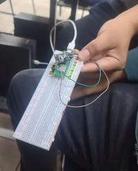

# Caja de 37 sensores

### Sistemas programables
### Instituto tecnologico de tijuana
- Integrantes del equipo
- Castro Pacheco Jose Manuel
- Benitez Peraza Joshua
- Cruz Eduardo Valadez Melendez
- Garcia Juarez Isai

Por ultimo el video demostrando que funciona correctamente se mando por classroom, ya que al momento de ingresar dicho video por aqui se hay bastante complicaciones para poder que este funcione correctamente
